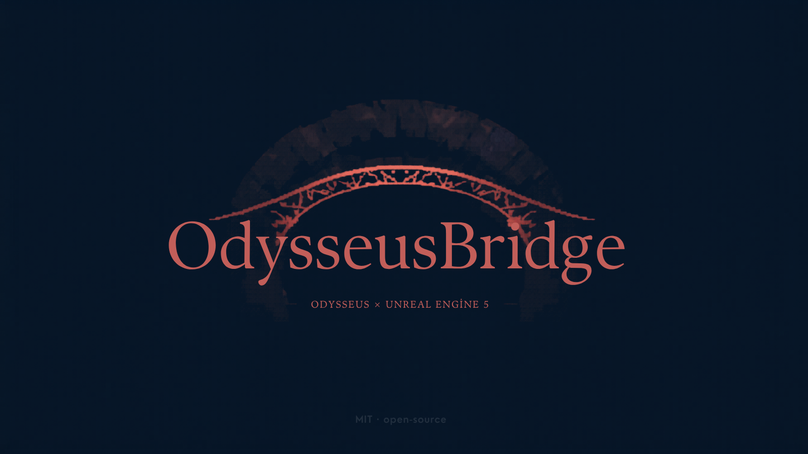

<p align="center">
  
</p>

# OdysseusBridge — an Unreal Engine 5.7 plugin for Odysseus

**What it is.** A small Unreal Engine 5.7 *editor* plugin that runs an MCP server **inside the live
editor**. Once it's installed and the editor is open, **Odysseus** can read your project and make real
changes to it by talking to the editor over a local API — no copying code back and forth, no recompiling
between steps. In short: it's the *hands* that let Odysseus actually work inside Unreal, in your own
`.uproject`.

**Why it exists.** An AI agent can happily *write* Unreal Python, but on its own it can't *run* that
Python in your open editor — so nothing actually happens to your project. OdysseusBridge closes that gap
with one local, authenticated channel: the agent sends a command, the editor runs it on the spot and
sends back the real result (or the real error). It speaks standard MCP, so it isn't tied to one client —
but it's built for Odysseus.

```
Odysseus ──MCP / JSON-RPC over HTTP──▶ OdysseusBridge (inside the editor) ──▶ UE editor · `unreal` Python API
         ◀────────── result / log / traceback ──────────
```

## How it works (the flow, end to end)
1. **Load.** The plugin is an *Editor* module. When you open your project, Unreal loads it.
2. **Listen.** On startup it opens an HTTP server on **`127.0.0.1:8762`** using Unreal's own built-in
   `FHttpServerModule` (nothing external), and mints a random **per-session token**, written to
   `<YourProject>/Saved/OdysseusBridge/auth_token`.
3. **Speak MCP.** Odysseus connects and talks the Model Context Protocol over JSON-RPC 2.0 (`POST /mcp`):
   `initialize` → `tools/list` → `tools/call`. A second route, `GET /odysseus/health`, is a liveness ping.
4. **Gate every call.** A request is served only if it comes from this machine (`127.0.0.1`/`::1`) **and**
   carries the bearer token. Anything else gets `403` (off-box) or `401` (no/wrong token).
5. **Run on the right thread.** `tools/call` executes on the editor's **game thread** — which is where
   Unreal Python must run — via `IPythonScriptPlugin`. The bridge captures stdout + the result/traceback
   and returns it as MCP content. So when Odysseus spawns an actor, an actor really appears in your level.

## What Odysseus can reach (the tools)
The plugin exposes **eight native MCP tools**. They show up in `tools/list`, so the agent discovers them
automatically:

| Tool | What it does | How |
|---|---|---|
| `project_info` | project name, directory, engine version | direct, no args |
| `run_python` | **the workhorse** — runs any Python in the live editor | the full `unreal` API is in scope; returns log + result/traceback |
| `list_assets` | asset paths under a content folder | `EditorAssetLibrary.list_assets` |
| `spawn_actor` | spawns N `StaticMeshActor`s with a mesh | `EditorActorSubsystem` |
| `datatable_rows` | a DataTable's row names | `DataTableFunctionLibrary` |
| `create_blueprint` | creates a Blueprint asset (given a parent class) | `BlueprintFactory` + `AssetTools` |
| `create_material` | creates a Material asset | `MaterialFactoryNew` + `AssetTools` |
| `import_asset` | imports a file (FBX / image / …) into the content browser | `AssetImportTask` |

**Why only eight native ones?** Because `run_python` already reaches the *entire* editor Python API —
editing materials, running commandlets, building levels, anything scriptable. The seven typed tools are
just the common moves wrapped as one-call shortcuts (they each compose a small `unreal` Python snippet and
run it through the same executor). You're never limited to the eight.

## Where everything lives (file map)
```
OdysseusBridge/                         the UE plugin  → copy into <YourProject>/Plugins/
  OdysseusBridge.uplugin                plugin manifest (Editor module, Win64, depends on PythonScriptPlugin)
  Source/OdysseusBridge/
    Public/OdysseusBridge.h             the module class
    Private/OdysseusBridge.cpp          the whole server: endpoint, auth, JSON-RPC dispatch, the 8 tools
    OdysseusBridge.Build.cs             engine module deps (Core, CoreUObject, Engine, HTTPServer, Json, PythonScriptPlugin, Sockets)
scripts/connect_unreal.py               run from your Odysseus repo → registers the bridge as an MCP server
unreal_helpers.py                       optional guarded Python wrappers → drop in <YourProject>/Content/Python/
smoke_test.py                           end-to-end check (health → initialize → tools → run_python)
UE_ENGINEER.md                          optional agent prompt that keeps the agent disciplined on the editor
CREDITS.md · CHANGELOG.md · SETUP.md · LICENSE
```
At runtime the per-session token lives at `<YourProject>/Saved/OdysseusBridge/auth_token` — it's local;
`Saved/` is already in UE's `.gitignore`, so it never leaves your machine.

## Install — drop-in (Odysseus, 3 steps)
1. **Drop** the `OdysseusBridge/` folder into your UE project's `Plugins/` and open the editor. It builds
   on first open (because the source is there), starts the server, and writes the token. *Why open it?* —
   the bridge only lives while the editor is running; that's also why it can't touch your project when
   you're away.
2. **Register** it in Odysseus (run from your Odysseus repo, which has the DB layer):
   ```bash
   python scripts/connect_unreal.py --token-file "<YourProject>/Saved/OdysseusBridge/auth_token"
   ```
   This writes one enabled `McpServer` row (`id=odybridge`, the URL + token) so Odysseus auto-connects.
3. **Restart Odysseus.** It connects on startup; the eight tools appear to the agent as `mcp__odybridge__*`.

## Install — manual (any UE 5.7 project)
1. Copy `OdysseusBridge/` into `<YourProject>/Plugins/`.
2. Enable it in `<YourProject>.uproject`:
   ```json
   "Plugins": [ { "Name": "OdysseusBridge", "Enabled": true } ]
   ```
3. Build the editor target (or just open the project — it offers to compile):
   ```powershell
   & "<UE>\Engine\Build\BatchFiles\Build.bat" <Project>Editor Win64 Development `
     -Project="<...>\<YourProject>.uproject" -WaitMutex
   ```
4. *(optional)* copy `unreal_helpers.py` into `<YourProject>/Content/Python/` (UE auto-imports it) for the
   guarded helper wrappers — each returns `ERR: …` instead of throwing, so a wrong API name can't crash a run.

## Run & connect (any MCP client)
Open the editor; it logs `OdysseusBridge MCP listening at http://127.0.0.1:8762/mcp`. Set
`ODYSSEUS_BRIDGE_PORT` to pin a different port.
```
MCP    : http://127.0.0.1:<port>/mcp            (JSON-RPC 2.0, streamable HTTP, multi-client)
health : http://127.0.0.1:<port>/odysseus/health
auth   : Authorization: Bearer <token from <Project>/Saved/OdysseusBridge/auth_token>
```

## Security — opt-in, and why it's safe
- **Loopback-only.** Requests from anything other than `127.0.0.1` / `::1` are refused (`403`). The
  endpoint is unreachable from other machines, so it can't be hit over a network.
- **Per-session token.** A fresh secret is generated each time the editor starts and written locally;
  every `/mcp` call must present it or it's `401`. A new editor session ⇒ a new token.
- **Game-thread only.** Python runs on the game thread in-process — no shelling out, no extra runtime.
- **Inert by default.** Nothing runs unless you install + enable the plugin *and* open the editor. Keep
  your project under version control so every change an agent makes stays reviewable in your diff.

## Verify it works
```bash
python smoke_test.py 8762 <token>
# health -> initialize -> tools/list -> project_info -> run_python
```

## Extend it — add your own native tool
Everything lives in `OdysseusBridge/Source/OdysseusBridge/Private/OdysseusBridge.cpp`:
1. add the tool's schema (name + description + inputSchema) to `HandleToolsList()`,
2. add an `else if (Tool == "your_tool")` branch in `HandleToolsCall()` — build a small `unreal` Python
   string and run it through the shared `RunEditorPython()` helper,
3. rebuild. New engine module? add it to `OdysseusBridge.Build.cs`. New plugin dep? `OdysseusBridge.uplugin`.

HTTP handlers run on the game thread, so editor/Python calls inside a tool are safe.

## The UE Engineer skill — its tale
`UE_ENGINEER.md` is not filler — it's the *distilled* core of a much larger body of work. It was curated
down from a full **UE 5.7 state-of-the-art game-developer discipline**: the practice that knows *which*
Unreal system fits a problem (Actors vs **Mass/ECS** for crowds, **GAS** for abilities, **StateTree/EQS**
for AI, **Nanite/Lumen/Substrate** for rendering), knows each one's **shippability tier** (production vs
beta vs experimental — so an agent never quietly builds on prototype tech), and **profiles before
optimizing**. That whole body of engineering judgment was compressed into one agent prompt, together with
the operating disciplines we use everywhere:

- **the loop** — recon → one small action → read it back → verify → a single PASS/FAIL verdict;
- **data-driven by default** — new stats / abilities / economy belong in DataTables, Structs, DataAssets, never hardcoded;
- **honesty under pressure** — never claim a result you didn't actually get; flag Experimental tech instead of shipping on it.

So loading it doesn't just give the agent a *tone* — it hands it the *practice* of a careful UE engineer.
It's the difference between an agent that merely *can* call the tools and one that uses them *well*; with
it loaded, even a small local model works in disciplined, verifiable steps instead of guessing.

## Footprint
~454 lines of C++ (~415-line `.cpp` + 39-line header) + a 24-line build file — **no external
dependencies**, it uses only engine modules already present in your editor. Roughly a third of the `.cpp`
is reusable helpers (port pick, RFC-8259 escaping, auth, JSON), a third is the HTTP lifecycle + request
dispatch, and a third is the eight tools.

## Requirements
- Unreal Engine 5.7 (Win64)
- Visual Studio 2022 with the C++ game-dev workload (to compile the plugin)
- See **`SETUP.md`** for the full build/connect/troubleshoot guide (incl. the .NET 4.8 Dev Pack gotcha).

## Built on
MIT — see `LICENSE`. Built on the open **Model Context Protocol** (Anthropic) and Unreal's **public**
plugin / HTTP / Python APIs (Epic Games), and improves on **[appleweed/UnrealMCPBridge](https://github.com/appleweed/UnrealMCPBridge)**
(MIT) — a standards-based HTTP + JSON-RPC transport with token auth instead of a raw socket. Full
attribution in **`CREDITS.md`**.

---
<sub>Canım abim, Deniz'im adına / For my dear brother, my Deniz.</sub>
